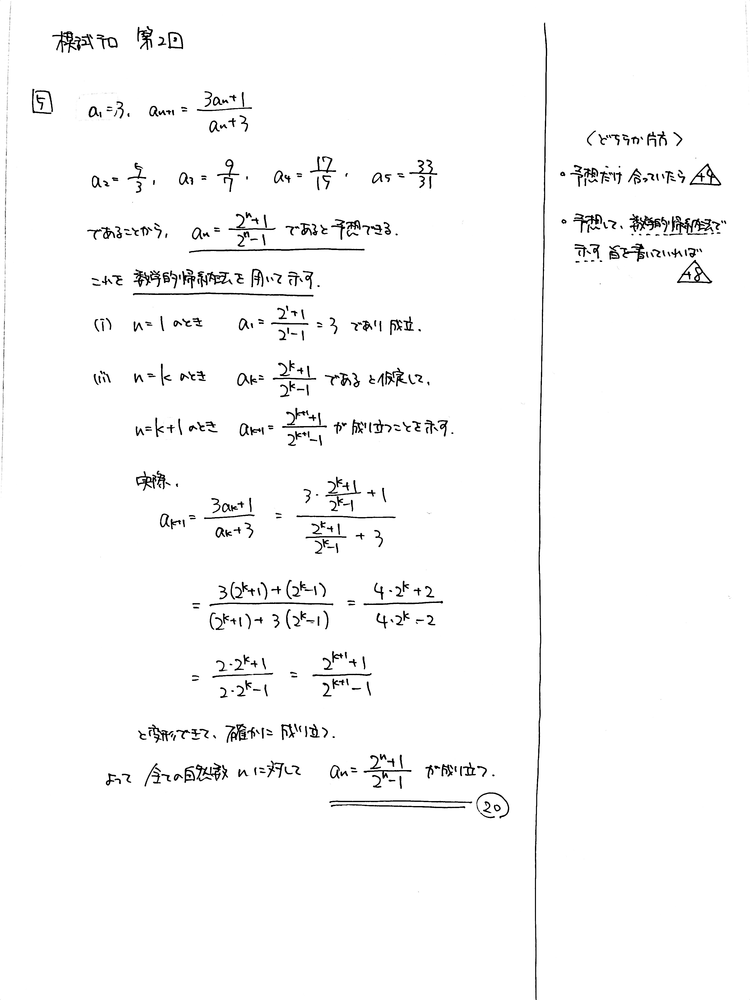
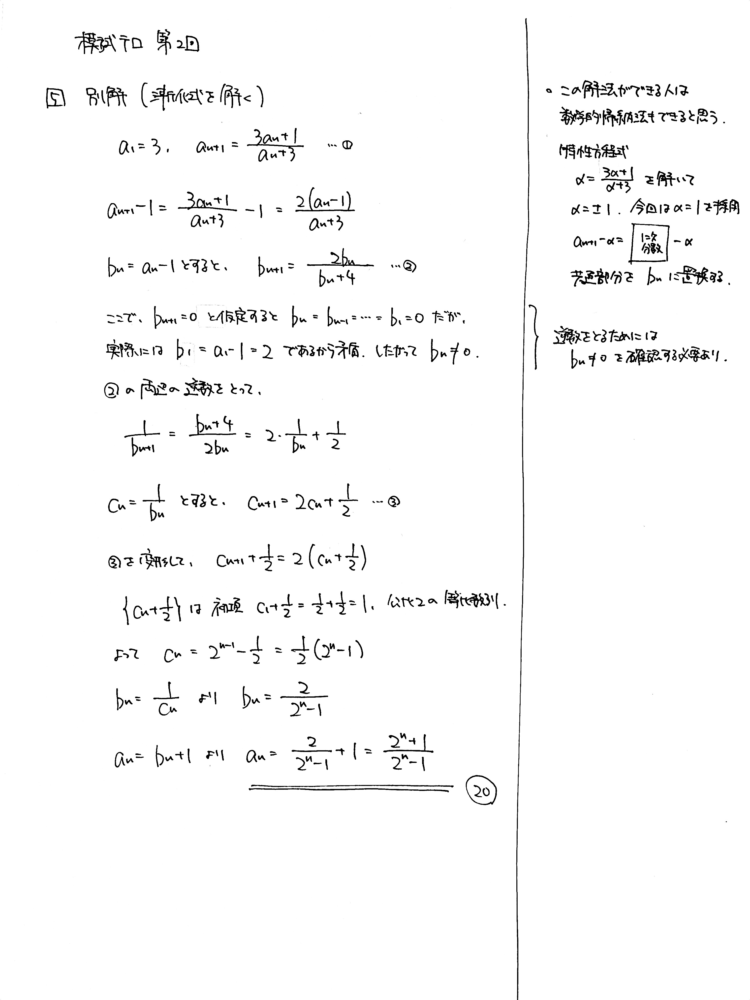

---
layout: default
parent: 第 2 回
grand_parent: 模試テロ
summary: 1次分数型漸化式
published: false
---

# 大問 5

## 問題・配点

数列 $\lbrace a_n \rbrace$ を $$ a_1=3,\ \ a_{n+1} = \frac{3a_n+1}{a_n+3} \ \ (n=1,\ 2,\ 3,\ \dots) $$ で定める. 一般項 $a_n$ を求めよ. (20)

## 解説

$1$ 次分数型の漸化式です。相当に力のある受験生ならこの漸化式の解き方を知っていて、どうにか誘導なしで解けるのでしょうが、おそらく厳しいでしょう。

一見解けなさそうな漸化式の場合、$a_n$ を順に調べて規則性を見つけ、一般項を推測する方法があります。この問題は実質的に数学的帰納法の問題でした。意欲のある人のために、漸化式を正面突破する方法も別解に載せました。

