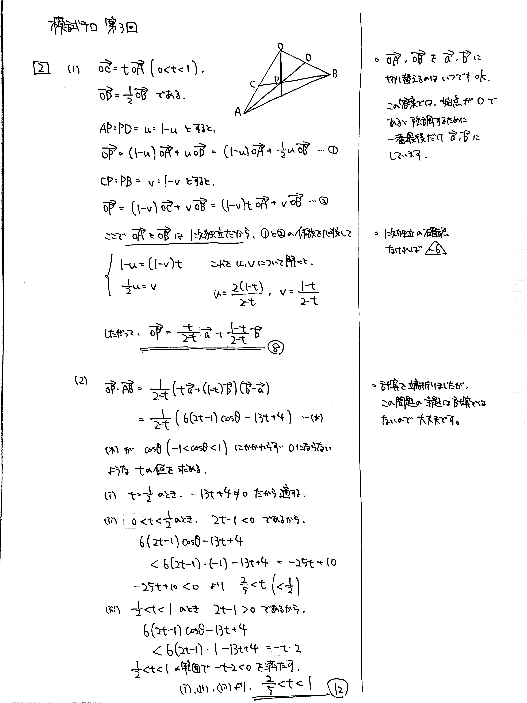

---
layout: default
parent: 第 3 回
grand_parent: 模試テロ
summary: 垂直にならない条件
published: false
---

# 大問 2

## 問題・配点

$\triangle \mathrm{OAB}$ において, $\mathrm{OA}=3$, $\mathrm{OB}=2$, $\angle \mathrm{AOB} = \theta \ (0 < \theta < \pi)$ とする. $0<t<1$ を満たす実数の定数 $t$ に対して, 辺 $\mathrm{OA}$ を $t:(1-t)$ に内分する点を $\mathrm{C}$, 辺 $\mathrm{OB}$ の中点を $\mathrm{D}$, 線分 $\mathrm{AD}$ と線分 $\mathrm{BC}$ の交点を $\mathrm{P}$ とする.

(1) $\overrightarrow{\mathrm{OA}}=\overrightarrow{a}$, $\overrightarrow{\mathrm{OB}}=\overrightarrow{b}$ とする. $\overrightarrow{\mathrm{OP}}$ を $t$, $\overrightarrow{a}$, $\overrightarrow{b}$ を用いて表せ.

(2) 任意の $\theta$ に対して $\overrightarrow{\mathrm{OP}}$ と $\overrightarrow{\mathrm{AB}}$ が垂直にならないような $t$ の値の範囲を求めよ.

## 解説

(1) 比が文字式で表されていても、やることは変わりません。$\overrightarrow{\mathrm{OP}}$ を $2$ 通りに表して係数比較です。

(2) 内積 $\overrightarrow{\mathrm{OP}} \cdot \overrightarrow{\mathrm{AB}}$ の値を調べます。難しいです。

