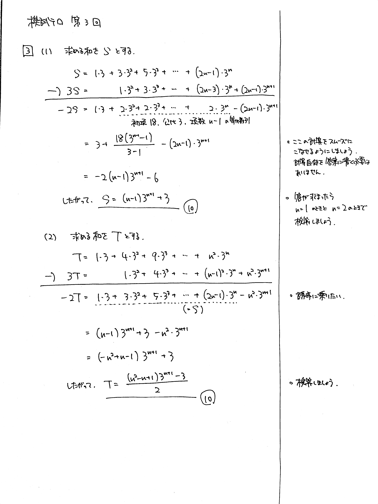

---
layout: default
parent: 第 3 回
grand_parent: 模試テロ
summary: 
published: false
---

# 大問 3

## 問題・配点

(1) 以下の数列の初項から第 $n$ 項までの和を求めよ.
$$ 1 \cdot 3,\ 3 \cdot 3^2,\ 5 \cdot 3^3,\ \cdots\cdots,\ (2n-1) \cdot 3^n $$

(2) 以下の数列の初項から第 $n$ 項までの和を求めよ.
$$ 1 \cdot 3,\ 4 \cdot 3^2,\ 9 \cdot 3^3,\ \cdots\cdots,\ n^2 \cdot 3^n $$

## 解説

(等差)×(等比) 型、いわゆる**かけずらし**タイプの数列の和を求める問題です。(1) と同様に (2) を求めようとすると、ちょうどよく (1) の結果を使うことができます。

