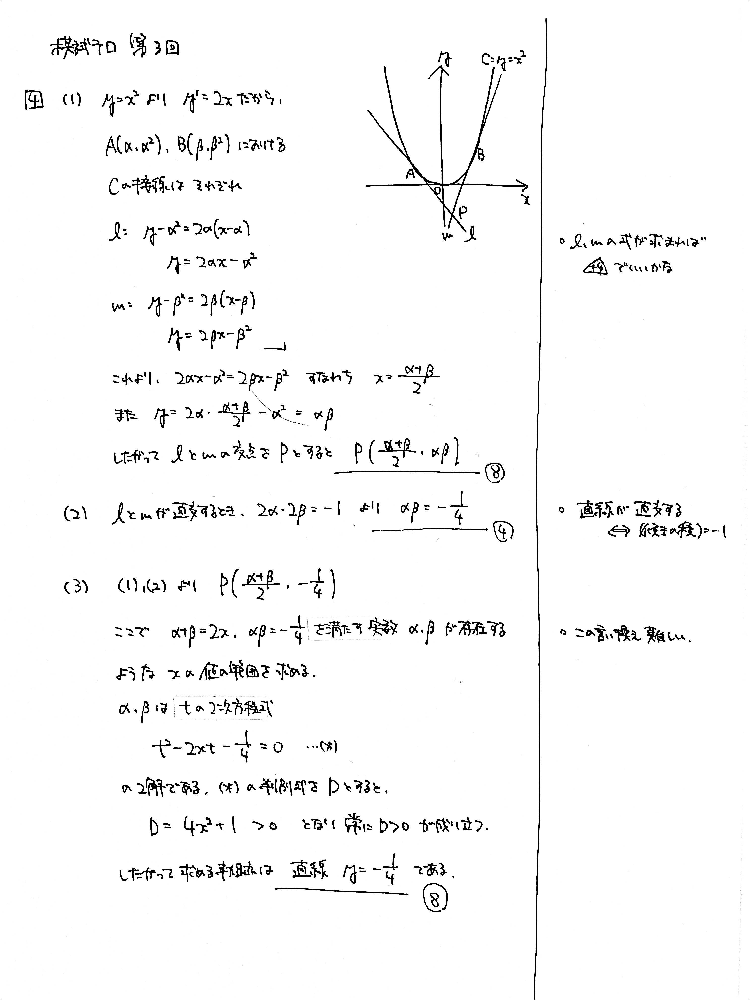

---
layout: default
parent: 第 3 回
grand_parent: 模試テロ
summary: 
published: false
---

# 大問 4

## 問題・配点

放物線 $C: y=x^2$ 上に, $2$ 点 $\mathrm{A}(\alpha,\ \alpha^2)$, $\mathrm{B}(\beta,\ \beta^2)$ をとる. ただし, $\alpha \neq \beta$ とする. 点 $\mathrm{A}$ における $C$ の接線を $l$, 点 $\mathrm{B}$ における $C$ の接線を $m$ とする. 

(1) 直線 $l$, $m$ の交点の座標を $\alpha$, $\beta$ を用いて表せ.

(2) 直線 $l$, $m$ が直交するとき, $\alpha\beta$ の値を求めよ.

(3) 直線 $l$, $m$ が直交するとき, その交点の軌跡を求めよ.

## 解説

放物線の準線を題材にした問題です。詳しくは[こちら](https://examist.jp/mathematics/differential/houbutusen-jyunsen/)

