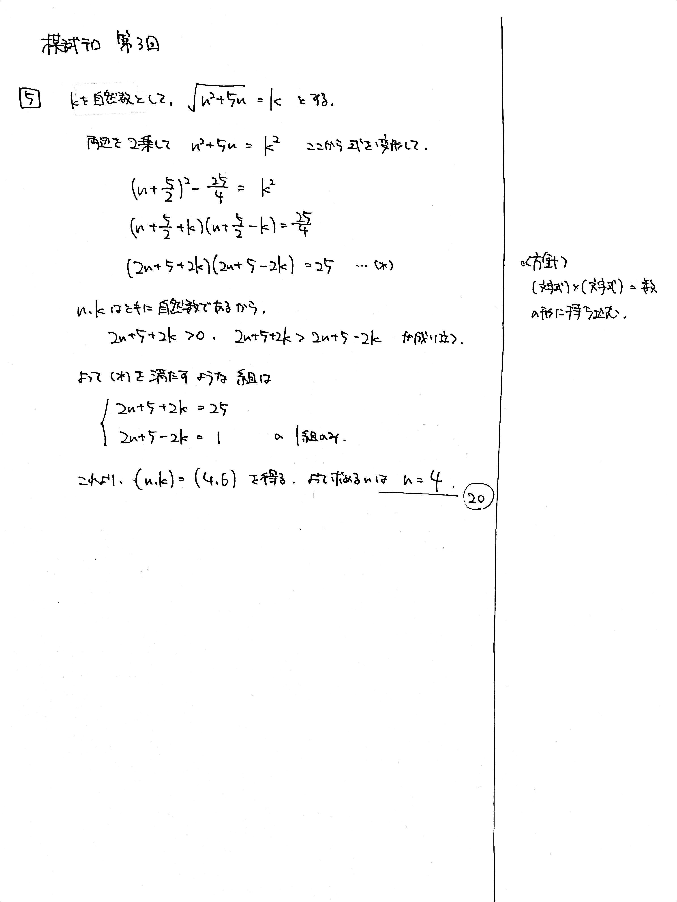

---
layout: default
parent: 第 3 回
grand_parent: 模試テロ
summary: 
published: false
---

# 大問 5

## 問題・配点

$\sqrt{n^2+5n}$ が整数になるような自然数 $n$ をすべて求めよ.

## 解説

式の値が整数になる条件を求める問題です。数テロ改では [2021/07/16](https://kampachi-dev.github.io/mathterro/2021/20210716_alg/) でほぼ同じ問題を扱いました。

