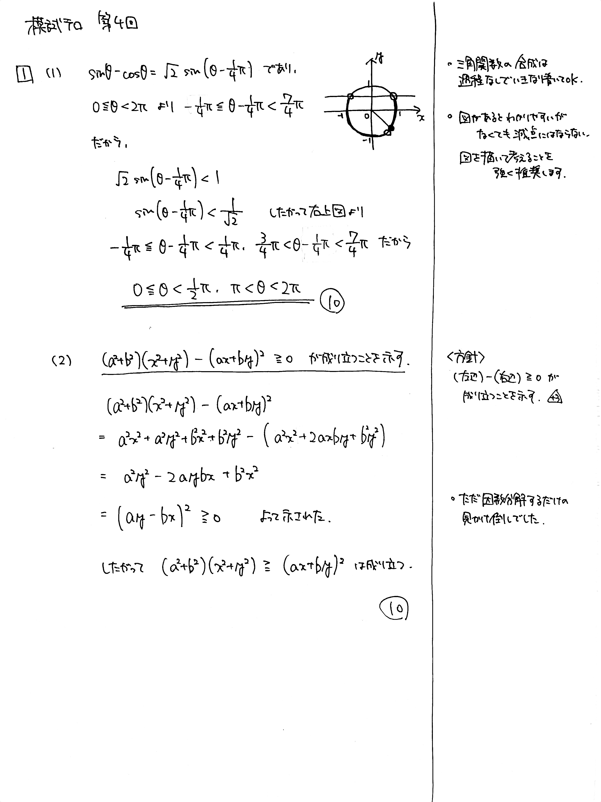

# 大問 1

## 問題・配点

(1) $0 \leqq \theta < 2\pi$ のとき, $\theta$ の不等式 $\sin \theta - \cos \theta < 1$ を解け.

(2) $a$, $b$, $x$, $y$ を実数とする. 不等式 $$ (a^2+b^2)(x^2+y^2) \geqq (ax+by)^2 $$ が成り立つことを示せ.

## 解説

(1) 三角関数を合成して、不等式を解くのみです。

(2) **コーシー・シュワルツ Cauchy-Schwarz の不等式**の証明です。不等式を示すときは右辺と左辺をまとめて正であることを確認する、基本です。ちなみにこの性質を使って解く問題が結構あります。

