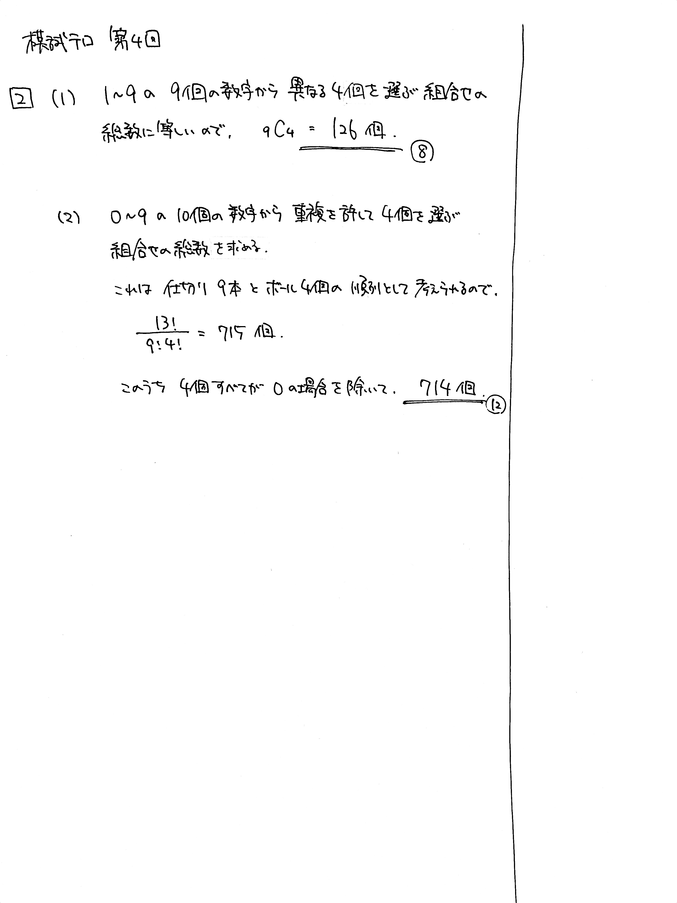

---
layout: default
parent: 第 4 回
grand_parent: 模試テロ
summary: 整数の個数の数え上げ
published: false
---

# 大問 2

## 問題・配点

$4$ 桁の整数の千の位, 百の位, 十の位, 一の位をそれぞれ $a$, $b$, $c$, $d$ $(a \neq 0)$ とする.

(1) $a<b<c<d$ を満たす $4$ 桁の整数の個数を求めよ.

(2) $a \geqq b \geqq c \geqq d$ を満たす $4$ 桁の整数の個数を求めよ.

## 解説

整数の個数を数える問題です。そのまま数えると大変なことになるので、組合せの考え方を使って工夫する必要があります。

**手がかりがつかめないときは書き出して実験し、よく観察する**のが大切です。

(1) $a$, $b$, $c$, $d$ がすべて異なります。$1$ から $9$ までの数字の中から $4$ つ選び、<u>小さい順に並べる</u>ことで条件を満たす $4$ 桁の数を作れることがわかります。ここで、小さい順に並べる並べ方は必ず $1$ 通りなので、選び方だけ考えればよいです。

(2) (1) と異なり、数字の重複が許されます。球と仕切りを使った考え方を使えそうです。

ちなみに、赤チャートに同じ問題が載っていました。

