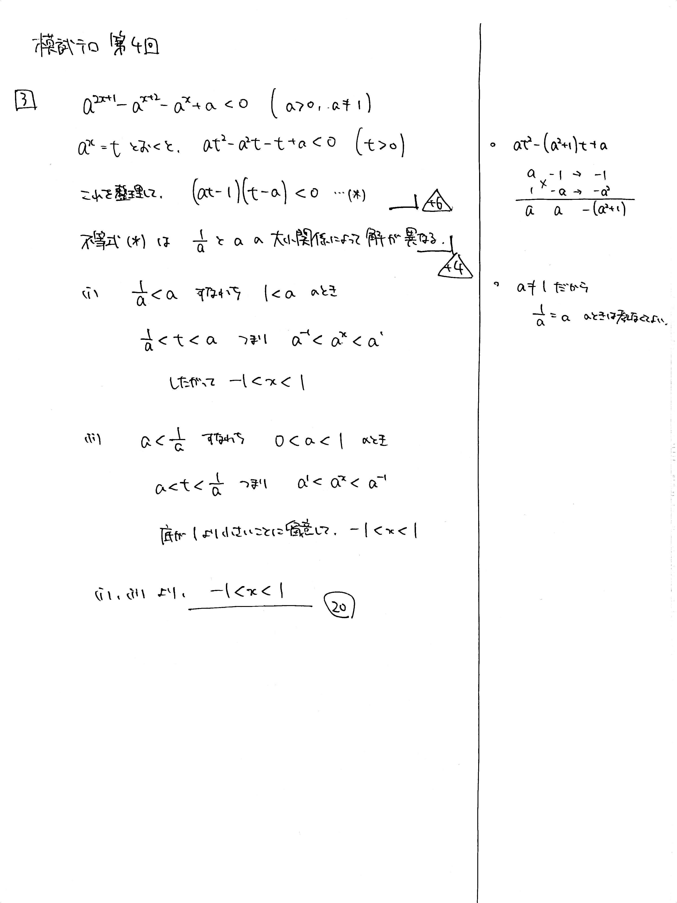

---
layout: default
parent: 第 4 回
grand_parent: 模試テロ
summary: 
published: false
---

# 大問 3

## 問題・配点

$a$ を実数の定数とし, $a>0$, $a \neq 1$ とする. 以下に示す $x$ の不等式を解け.
$$ a^{2x+1}-a^{x+2}-a^x+a<0 $$

## 解説

全く $x$ の式には見えないですね。$t=a^x \ (t>0)$ とおくと $$ at^2-(a^2+1)t+a<0 $$ となり、左辺を因数分解して $$ (at-1)(t-a)<0 $$ となります。この先に場合分けが必要になります。難しかったですね。

解答の過程は長くないのですが、それぞれの式変形を注意深くこなしていく必要があります。自分が今書いている式が論理的に正当かどうか、慎重に検討しながら進めましょう。

