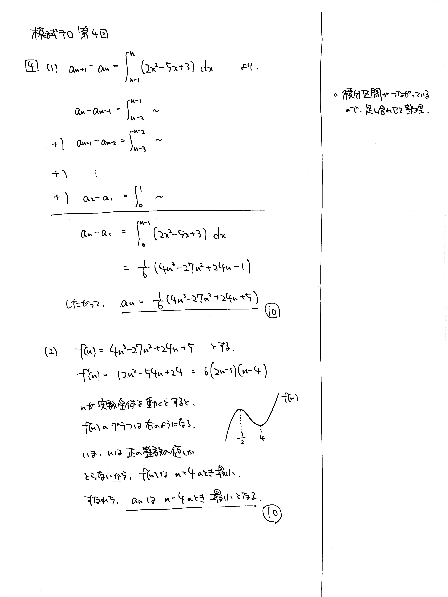

---
layout: default
parent: 第 4 回
grand_parent: 模試テロ
summary: 数列の階差の積分表記
published: false
---

# 大問 4

## 問題・配点

数列 $\lbrace a_n \rbrace$ を $$ a_1=1,\ \ a_{n+1}-a_n=\int_{n-1}^n (2x^2-5x-3)dx  \ \ (n=1,\ 2,\ 3,\ \dots) $$ で定める.

(1) 一般項 $a_n$ を $n$ の式で表せ.

(2) $a_n$ が最小になるときの $n$ の値を求めよ.

## 解説

微積分と数列の融合問題です。見た目の派手さに比べてやることはシンプルです。(1) をよく観察して計算量を減らしましょう。

