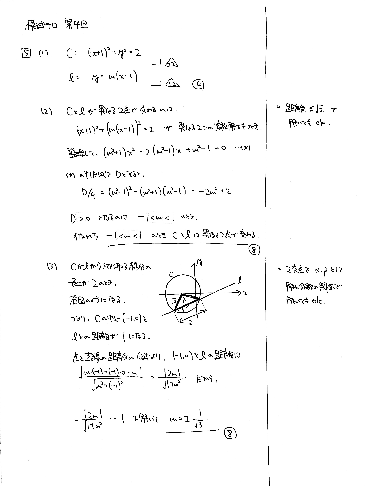

---
layout: default
parent: 第 4 回
grand_parent: 模試テロ
summary: 円と直線
published: false
---

# 大問 5

## 問題・配点

中心 $(-1,\ 0)$, 半径 $\sqrt{2}$ の円 $C$ と, 定点 $(1,\ 0)$ を通り, 傾きが $m$ の直線 $l$ を考える.

(1) 円 $C$, 直線 $l$ の方程式をそれぞれ求めよ.

(2) $C$ と $l$ が異なる $2$ 点で交わるような $m$ の値の範囲を求めよ.

(3) $C$ が $l$ から切り取る線分の長さが $2$ のとき, $m$ の値を求めよ.

## 解説

円と直線の弦に関する問題です。(3) は計算でゴリ押しする方法と図形的に考察して計算量を減らす方法があります。

