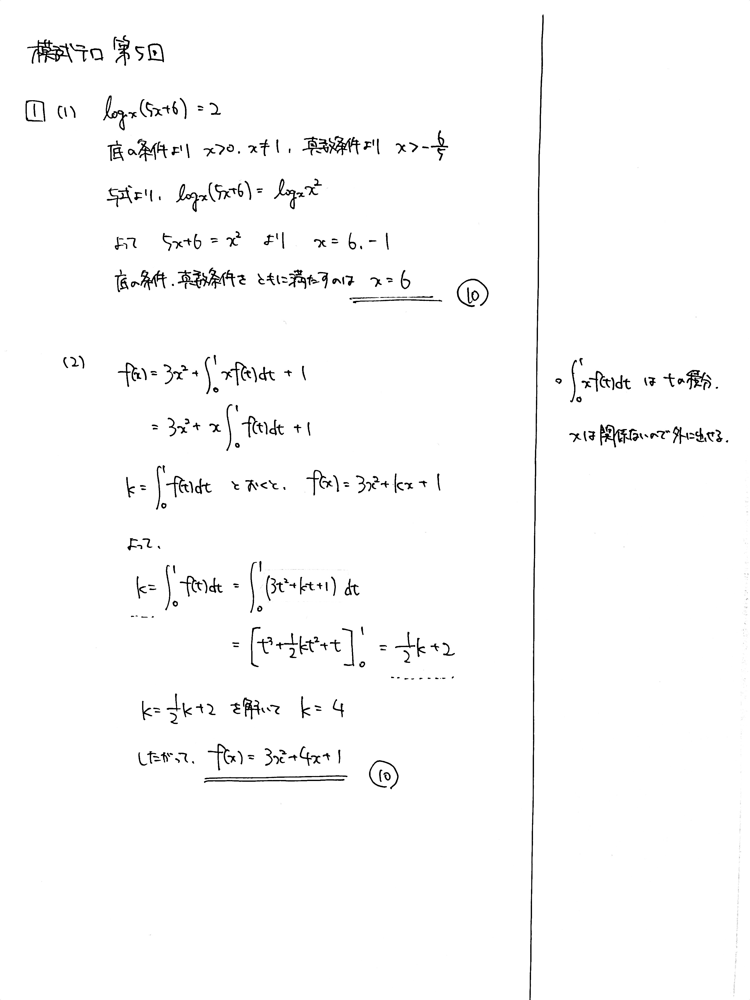

---
layout: default
parent: 第 5 回
grand_parent: 模試テロ
summary: 対数方程式 / 積分方程式
---

# 大問 1

## 問題

(1) $x$ の方程式 $\log_x (5x+6)=2$ を解け.

(2) $f(x)=3x^2+ \displaystyle \int_0^1 xf(t)dt + 1$ を満たす関数 $f(x)$ を求めよ.

## 解説

(1) 対数方程式ですが、底に文字が含まれています。底の条件 $x>0$, $x \neq 1$ に注意して解きましょう。

(2) 積分方程式ですが、$\displaystyle \int_0^1 xf(t)dt$ をどのように処理するかで悩んだかもしれません。これは $t$ についての積分なので、$x$ は無関係です。つまり、$x$ はただの係数で、積分の外に出すことができます。

