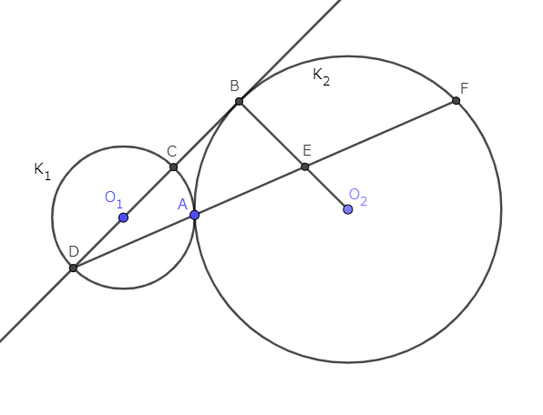
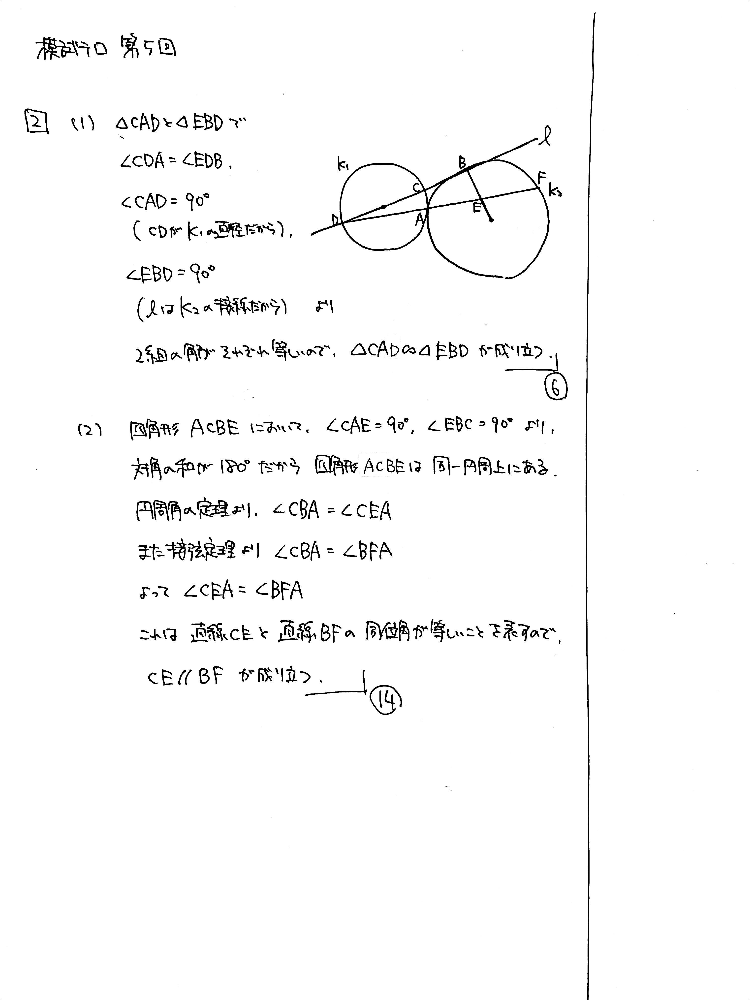

---
layout: default
parent: 第 5 回
grand_parent: 模試テロ
summary: 相似の証明 / 平行線の証明
---

# 大問 2

## 問題

点 $\mathrm{A}$ で外接する $2$ 円 $K_1$, $K_2$ の中心をそれぞれ $\mathrm{O}_1$, $\mathrm{O}_2$ とする. $\mathrm{O}_1$ を通る $K_2$ の接線のうち $1$ 本を $l$ とする. $l$ と $K_2$ との接点を $\mathrm{B}$, $l$ と $K_1$ との $2$ 交点を $\mathrm{B}$ に近い順に $\mathrm{C}$, $\mathrm{D}$ とする. また, 直線 $\mathrm{AD}$ と直線 $\mathrm{BO_2}$ との交点を $\mathrm{E}$, 直線 $\mathrm{AD}$ と $K_2$ との $2$ 交点のうち $\mathrm{A}$ でないものを $\mathrm{F}$ とする.

(1) $\triangle \mathrm{CAD}$ と $\triangle \mathrm{EBD}$ は相似であることを示せ.

(2) $\mathrm{CE}$ と $\mathrm{BF}$ は平行であることを示せ.

## 解説

まずは正確に図を描きましょう。もちろん位置関係はこの図の通りでなくてもよいです。図を正しく描けなかった人は、問題文で使っている用語を再確認しましょう。

(1) ただ単に相似の証明です。

(2) 2 直線が平行なことを示すために、同位角や錯角が等しいことを示すのは典型ですが、その角をどのように見つけるか？という部分が難しいです。

