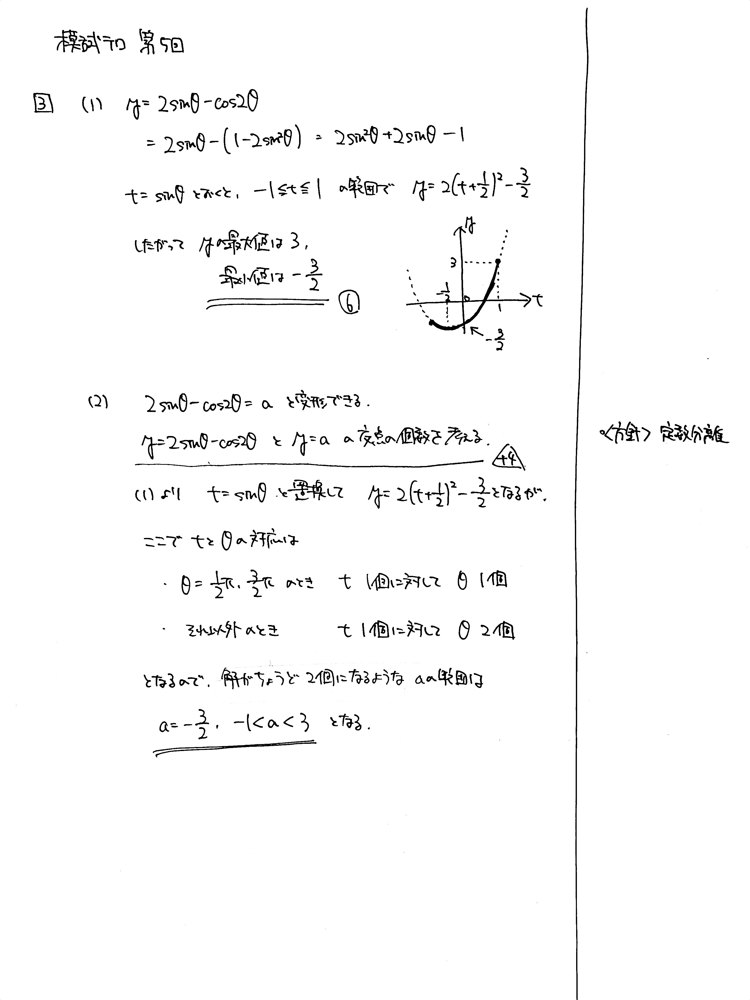

---
layout: default
parent: 第 5 回
grand_parent: 模試テロ
summary: 三角関数と方程式の解の個数
---

# 大問 3

## 問題

(1) $y=2\sin \theta - \cos 2 \theta$ とする. $y$ の最大値と最小値を求めよ.

(2) $a$ を実数の定数とする. $\theta$ の方程式 $2\sin \theta - \cos 2 \theta -a=0$ が異なる $2$ 解をもつように $a$ の値の範囲を定めよ.

## 解説

(1) 2 倍角の定理を使って $\sin \theta$ に統一しましょう。

(2) おなじみの**定数分離**です。$ 2 \sin \theta - \cos 2 \theta = a$ の形にして、$y=2 \sin \theta - \cos 2 \theta$ と $y=a$ のグラフの交点を数えるのでした。

しかしここで罠があります。$t=\sin\theta$ とおいて $2$ 次関数にすると、$t$ と $\theta$ が 1 対 1 対応でなくなります。具体例としては、$t=\dfrac{1}{2}$ のとき $\theta = \dfrac{1}{6}\pi,\dfrac{5}{6}\pi$ です。つまり、ただグラフの交点の個数を数えるだけでなく、実際の解の個数を別に考える必要がありました。

作題者としては、「異なる解がちょうど 2 つあるように」というつもりで書いていたのですが、文章をよく読むと「異なる解が 2 つ以上あるように」とも読めることに気付きました。これは作題側のミスです。迷った方がもしいれば申し訳ありません。

