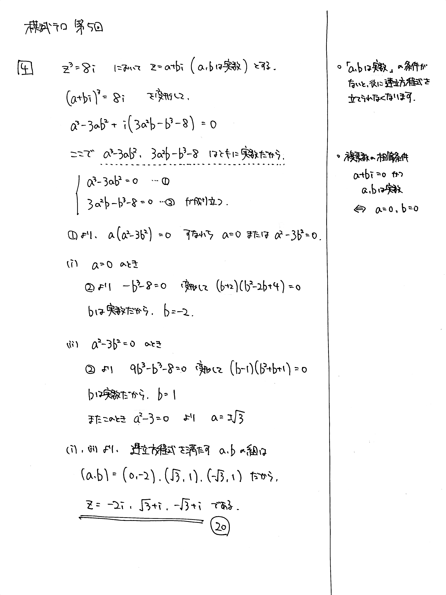

---
layout: default
parent: 第 5 回
grand_parent: 模試テロ
summary: 複素数の方程式
---

# 大問 4

## 問題

$i$ を虚数単位とする. 複素数 $z$ の方程式 $z^3=8i$ を解け.

## 解説

数学 II までの複素数の扱い方は、

**$a$, $b$ を実数として $z=a+bi$**

が直感的です。実部と虚部に分けて連立方程式を解きます。

連立方程式とはいうものの、ただ加減や代入をしても解けないタイプです。因数分解→場合分けの流れを押さえましょう。

ちなみに、数学 III では複素数平面を学習しますが、そこで習得する極形式を使った解法のほうが簡潔です。

また、$x^3 + 8i$ を因数分解できれば、もっと簡潔です。

