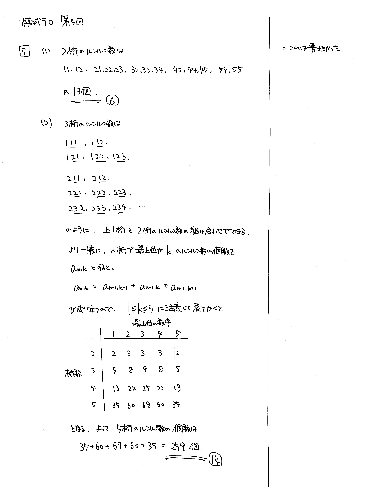

---
layout: default
parent: 第 5 回
grand_parent: 模試テロ
summary: 条件を満たす自然数の数え上げ
---

# 大問 5

## 問題

正の整数 $X$ が以下の条件を満たすとき, $X$ は**ルンルン数**であるという.

- $n$ を $n \geqq 2$ を満たす自然数とする. $X$ は $n$ 桁の整数である.
- $X$ の各桁を上の位から順に $X_1,\ X_2,\ \dots,\ X_n$ とする.
    - すべての自然数 $1 \leqq k \leqq n$ に対して, $1 \leqq X_k \leqq 5$
    - すべての自然数 $1 \leqq k \leqq n-1$ に対して, $|X_{k+1} - X_k| \leqq 1$

例えば, $21$, $334$ は**ルンルン数**であり, $2$, $456$, $31415$ は**ルンルン数**ではない.

(1) $2$ 桁の**ルンルン数**の個数を求めよ.

(2) $5$ 桁の**ルンルン数**の個数を求めよ.

## 解説

**ルンルン数**という見慣れない数を定義して、その性質を考える問題です。

(1) 2 桁のルンルン数は数えるほどしかないので、実際に書き出してみるのがよいです。

(2) 5 桁のルンルン数はさすがに多いので、書き出すのは厳しいでしょう。そこで、3 桁のルンルン数を書いてみます。2 桁→ 3 桁の変化の仕方がわかれば、3 桁→ 4 桁、4 桁→ 5 桁と順に辿っていけそうです。

書き出してみると、3 桁のルンルン数は、2 桁のルンルン数に上 1 桁を付け足したものであることがわかります。つまり、$l_{n, k}$ を「$n$ 桁で最上位の数字が $k$ のルンルン数の個数」とすると、

$$ l_{3, k} = l_{2, k-1} + l_{2, k} + l_{2, k+1} $$

と表せます。この式は 3 桁以上で成り立つので、$n \geqq 3$ として

$$ l_{n, k} = l_{n-1, k-1} + l_{n-1, k} + l_{n-1, k+1} $$

となります。複雑に見えますが、これは漸化式の問題でした。表を作るとわかりやすくなります。

計算機科学の分野では、このように状態間の漸化式を立てて部分問題を解いていく手法を「動的計画法 (dynamic programming, dp)」と呼びます。

ルンルン数の元ネタ: [Lunlun Number](https://atcoder.jp/contests/abc161/tasks/abc161_d)
この問題の元ネタ: [1111gal password](https://atcoder.jp/contests/abc242/tasks/abc242_c)

