# 共線条件と共面条件と座標

## 共線条件

ベクトルの問題を解くうえでとても大切な共線条件の話です。

> $3$ 点 $\mathrm{O}$, $\mathrm{A}$, $\mathrm{P}$ が一直線上にあるとき, 適切な実数 $k$ を用いて $$ \overrightarrow{\mathrm{OP}} = k \overrightarrow{\mathrm{OA}} $$ と表せる.

図を描いて考えるとまあそりゃそうだろう、という話です。$\overrightarrow{\mathrm{OA}}$ を $k$ 倍すれば $\overrightarrow{\mathrm{OP}}$ になりますね。

突然ですが数直線を用意します。なじみ深いですね。

こちらも $\mathrm{OA}$ を $k$ 倍したら $\mathrm{OP}$ になっています。上のベクトルの図と下の数直線は、わりと似ていることがわかります。

**つまり、$k$ は座標を表しているのです。**

$k$ を大小させることで、数直線上のどの点でも表せます。同様に、$k$ を大小させることで、同一直線上のどのベクトルでも表せます。

> $\mathrm{P}$ が直線 $\mathrm{AB}$ 上にあるとき, $s+t=1$ を満たすような適切な実数 $s$, $t$ を用いて $$ \overrightarrow{\mathrm{OP}} = s \overrightarrow{\mathrm{OA}} + t \overrightarrow{\mathrm{OB}} $$ と表せる.

これも図を描いて考えてみましょう。

突然ですが座標平面を用意します。なじみ深いですね。$x$ 軸と $y$ 軸が垂直なので、**直交座標**といいます。

これを斜めにします。$x$ 軸と $y$ 軸が斜めに交わっているので、**斜交座標**といいます。

ここで点 $\mathrm{P}$ は直線 $x+y=1$ 上にあります。先ほどのベクトルの図とこの斜交座標は、わりと似ていることがわかります。

**つまり、$s$ と $k$ は座標を表しているのです。**