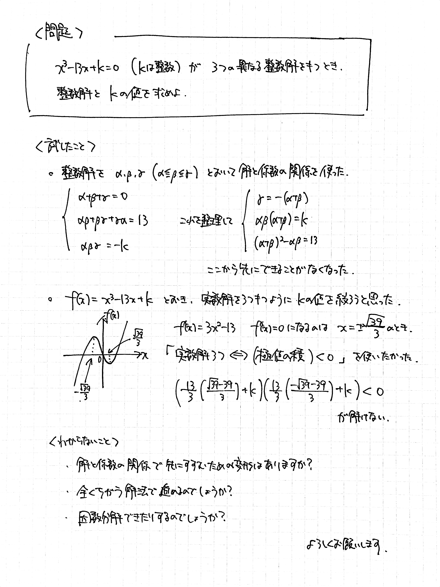

# 上手な質問ガイドライン

## 「わからない」

よく聞く言葉です。わからないものはわからないのです。「なんでできないの！」と言われても困るのです。

能力の高い先生は、話を聞いてどこで詰まっているか特定するのが得意な傾向があります。でも限度があります。「わからない」を解決するためには、自分である程度整理する必要があります。

## 上手な質問とは

特に情報系のエンジニアでよく共有されているのですが、上手な質問の仕方を身につけることで能力向上と効率化を図ることができます。具体的には、以下の3つを**必ず**書きます。

- この問題に困っている、このように解決したい
- 自分なりの解釈、自力で試してみたこと
- 知りたいこと

上手に質問するためには、どのようなことに気をつければよいのでしょうか？

## 質問するときにやること

### 自分で何がわからないのかを把握する

最大の壁です。人に質問をするには、自分が何を質問したいかを知っている必要があります。これは、「自分が今『何がわからないのか』がわかっていて、言語化できている」ということです。一見簡単なようですが、実はとても難しいことです。何がわからないかわからない人から質問を受けても、答える側も困ってしまいます。

**言語化する過程で、自分自身のわからないポイントを整理することで、質問するまでもなく問題が解けることがあります。**
質問するときは必ず言語化をしましょう。

### わかる範囲とわからない範囲を明確にする

ただ「わからない」「うまくいかない」と書いただけではあなたがどのステップまで進んだのか伝わりません。つまり、適切な回答は得られません。

そこで、以下のような表現を使って、具体的に困っている部分を伝えられるようにしましょう。

- 計算ができない
- 式変形の特定の部分が進められない
- 立式ができない
- 行き詰まってしまい、方針が正しいのか自信がない
- 幾何的な性質に気付けない
- (答えを見たあと) なぜその手法を用いるのかがピンとこない
- (答えを見たあと) なぜその手法を使おうという発想になるのかわからない

### 解決するために試してみたことを書く

問題を解くために試したことを書きましょう。

- 式変形をしてみた
- 図を描いてみた
- $n=1, 2, 3$ のような小さい数を代入してみた

ある程度答案を書いたなら、それを参考につけてもいいでしょう。しかし、質問には答案以上の日本語が必要です。

もしあなたが試した方法が間違っていれば、それを踏まえて回答をすることができます。あなたの理解もより深まるでしょう。

**なにも試していないのに聞くのは全くの論外です。「初手何をすればいいかわからない」問題は、高校数学にはほぼありません。**
きちんと自分で取り組んで調べたり試したりしているのに、「なにもしないで人に任せないで」と誤解されてしまわないようしっかりと書きましょう。

## 質問のためのテンプレート

質問を聞きに行くときにここまでできた状態で持っていきましょう。下の画像はあくまで例で、ここまでしっかり書けなくても大丈夫です。

`問題` `試したこと` `わからないこと` を必ず書くのが必須です。

---

この文書は、結城浩さんの「[技術系メーリングリストで質問するときのパターン・ランゲージ](https://www.hyuki.com/writing/techask.html)」を参考にし、作成しています。