# ベクトルと斜交座標

高校数学におけるベクトルの本当の姿を説明します。

## 共線条件

> $3$ 点 $\mathrm{O}$, $\mathrm{A}$, $\mathrm{P}$ が一直線上にあるとき, 適切な実数 $k$ を用いて $$ \overrightarrow{\mathrm{OP}} = k \overrightarrow{\mathrm{OA}} $$ と表せる.

図を描いて考えるとまあそりゃそうだろう、という話です。$\overrightarrow{\mathrm{OA}}$ を $k$ 倍すれば $\overrightarrow{\mathrm{OP}}$ になります。

突然ですが数直線を用意します。なじみ深いですね。

こちらも $\mathrm{OA}$ を $k$ 倍したら $\mathrm{OP}$ になっています。上のベクトルの図と下の数直線は、わりと似ていることがわかります。

**つまり、$k$ は座標を表しています。**

$k$ の大きさを調整すると、数直線上のどの点でも表せます。すなわち、同一直線上のどのベクトルでも表せます。

## 2点を通る直線の方程式

> $\mathrm{P}$ が直線 $\mathrm{AB}$ 上にあるとき, $s+t=1$ を満たすような適切な実数 $s$, $t$ を用いて $$ \overrightarrow{\mathrm{OP}} = s \overrightarrow{\mathrm{OA}} + t \overrightarrow{\mathrm{OB}} $$ と表せる.

これも図を描いて考えてみましょう。この図だけだとピンとこないと思います。

突然ですが座標平面を用意します。なじみ深いですね。$x$ 軸と $y$ 軸が垂直なので、**直交座標**といいます。この後の説明で使うので、直線 $x+y=1$ も引いておきました。

これを斜めにします。$x$ 軸と $y$ 軸が斜めに交わっているので、**斜交座標**といいます。ついでに、$x$ を $s$ に、$y$ を $t$ に置き換えます。

ここで点 $\mathrm{P}$ は直線 $s+t=1$ 上にあります。先ほどのベクトルの図とこの斜交座標は、わりと似ていることがわかります。

**つまり、$s$ と $t$ は座標を表しています。**

$s$ と $t$ の大きさを調整すると、平面上のどの点でも表せます。すなわち、平面上のどのベクトルでも表せます。

これが高校数学でのベクトルの本質です。一次独立なベクトルを $2$ 本用意すれば、平面上の任意の点を表せます。$3$ 本用意すれば、空間上の任意の点を表せます。

## 使用例

### 問題 1

まずは基本的なものから見ていきましょう。

> $\triangle \mathrm{OAB}$ において, $\overrightarrow{\mathrm{OP}} = s \overrightarrow{\mathrm{OA}} + t \overrightarrow{\mathrm{OB}}$, $s+t=3$ が成り立つとき, 点 $\mathrm{P}$ の存在範囲を図示せよ. 

この問題を教科書風に解くと、以下のようになります。

> $s+t=3$ より, $\dfrac{1}{3}s + \dfrac{1}{3}t = 1$.  
> また, $\overrightarrow{\mathrm{OP}} = \dfrac{1}{3}s \cdot 3 \overrightarrow{\mathrm{OA}} + \dfrac{1}{3}t \cdot 3 \overrightarrow{\mathrm{OB}}$ である.  
> ここで, $\dfrac{1}{3}s = s'$, $\dfrac{1}{3}t = t'$, $3\overrightarrow{\mathrm{OA}} = \overrightarrow{\mathrm{OA'}}$, $3\overrightarrow{\mathrm{OB}} = \overrightarrow{\mathrm{OB'}}$ とおくと,  
> $\overrightarrow{\mathrm{OP}} = s' \overrightarrow{\mathrm{OA'}} + t' \overrightarrow{\mathrm{OB'}}$, $s'+t'=1$ が成り立つ.  
> よって, 点 $\mathrm{P}$ は図の直線 $\mathrm{A'B'}$ 上にある.  
> 

なんかくどい解答です。特に怒涛の4連置換に圧を感じます。

では、斜交座標の考え方を用いた解答を書いてみます。高校生が書いても大丈夫なようにうまく表現してみました。[^1]

> $\mathrm{O}$ を原点とし, $\mathrm{A}(1,0)$, $\mathrm{B}(0,1)$ となるような斜交座標系 $st$ を考える.  
> $\overrightarrow{\mathrm{OP}} = s \overrightarrow{\mathrm{OA}} + t \overrightarrow{\mathrm{OB}}$ が成り立つことから, この斜交座標系において $\mathrm{P}(s,t)$ と表せる.  
> したがって, 点 $\mathrm{P}$ は図の直線 $s+t=3$ 上にある.  
> 

かなり簡潔に記述できていると思いますが、いかがでしょうか。

### 問題 2

> $\triangle \mathrm{OAB}$ において, $\overrightarrow{\mathrm{OP}} = s \overrightarrow{\mathrm{OA}} + t \overrightarrow{\mathrm{OB}}$, $0 \leqq s+t \leqq \dfrac{1}{2}$, $s \geqq 0$, $t \geqq 0$ が成り立つとき, 点 $\mathrm{P}$ の存在範囲を図示せよ.

斜交座標で解いてみます。ほとんど定型文です。

> $\mathrm{O}$ を原点とし, $\mathrm{A}(1,0)$, $\mathrm{B}(0,1)$ となるような斜交座標系 $st$ を考える.  
> $\overrightarrow{\mathrm{OP}} = s \overrightarrow{\mathrm{OA}} + t \overrightarrow{\mathrm{OB}}$ が成り立つことから, この斜交座標系において $\mathrm{P}(s,t)$ と表せる.  
> したがって, 点 $\mathrm{P}$ は $0 \leqq s+t \leqq \dfrac{1}{2}$, $s \geqq 0$, $t \geqq 0$ が成り立つ領域, すなわち図の網掛けの部分(境界を含む)に存在する.  
> 

斜交座標を設定すると、$s$ と $t$ の条件式がすべて座標平面上の図形で表せるので、とても見通しが立ちやすくなります。

### 問題 3

> $\triangle \mathrm{OAB}$ において, $\overrightarrow{\mathrm{OP}} = s \overrightarrow{\mathrm{OA}} + t \overrightarrow{\mathrm{OB}}$, $1 \leqq s \leqq 2$, $0 \leqq t \leqq 1$ が成り立つとき, 点 $\mathrm{P}$ の存在範囲を図示せよ.

この問題では $s$ と $t$ が独立しているので、普通に解くと大変です。[^2] しかし斜交座標で解くと瞬殺です。

> $\mathrm{O}$ を原点とし, $\mathrm{A}(1,0)$, $\mathrm{B}(0,1)$ となるような斜交座標系 $st$ を考える.  
> $\overrightarrow{\mathrm{OP}} = s \overrightarrow{\mathrm{OA}} + t \overrightarrow{\mathrm{OB}}$ が成り立つことから, この斜交座標系において $\mathrm{P}(s,t)$ と表せる.  
> したがって, 点 $\mathrm{P}$ は $1 \leqq s \leqq 2$, $0 \leqq t \leqq 1$ が成り立つ領域, すなわち図の網掛けの部分(境界を含む)に存在する.  
> 

### 問題 4

> $\triangle \mathrm{OAB}$ において, 辺 $\mathrm{OA}$ を $3:1$ に内分する点を $\mathrm{C}$, 辺 $\mathrm{OB}$ を $2:3$ に内分する点を $\mathrm{D}$ とし, 線分 $\mathrm{AD}$ と線分 $\mathrm{BC}$ の交点を $\mathrm{P}$ とする. また, 直線 $\mathrm{OP}$ と辺 $\mathrm{AB}$ の交点を $\mathrm{Q}$ とする. このとき, $\overrightarrow{\mathrm{OA}}$ と $\overrightarrow{\mathrm{OB}}$ を用いて $\overrightarrow{\mathrm{OP}}$ を表せ.

正攻法で解くのが簡単ですが(詳しくは [2022/01/07](https://kampachi-percy.github.io/mathterro/2022/20220107_vec/) の解答を参照してください)、斜交座標の考え方を用いても解けます。

> $\mathrm{O}$ を原点とし, $\mathrm{A}(1,0)$, $\mathrm{B}(0,1)$ となるような斜交座標系 $st$ を考える.  
> この斜交座標系において $\mathrm{P}(s,t)$ は $\overrightarrow{\mathrm{OP}} = s \overrightarrow{\mathrm{OA}} + t \overrightarrow{\mathrm{OB}}$ と表せる.  
> いま, $\mathrm{C}\left(\dfrac{3}{4},0 \right)$, $\mathrm{D}\left(0, \dfrac{2}{5}\right)$ と表せるので, 直線 $\mathrm{AD}$, $\mathrm{BC}$ の式はそれぞれ  
> 直線 $\mathrm{AD}: t=-\dfrac{2}{5}s+\dfrac{2}{5}$,   
> 直線 $\mathrm{BC}: t=-\dfrac{4}{3}s+1$ となる.  
> $\mathrm{P}$ はこれら $2$ 直線の交点だから, $\mathrm{P}\left(\dfrac{9}{14}, \dfrac{1}{7}\right)$ となる.  
> したがって, $\overrightarrow{\mathrm{OP}} = \dfrac{9}{14} \overrightarrow{\mathrm{OA}} + \dfrac{1}{7} \overrightarrow{\mathrm{OB}}$ である.  
> 

## 斜交座標の考え方で解決できないこと

斜交座標では、**長さ**と**角度**を扱うことはできません。[^3]

- 内積の値を用いるとき
    - 内積は長さと角度を用いて定義される量です。斜交座標では、長さと角度を直交座標と同じように考えることはできません。
- 曲線を扱うとき
    - 斜交座標上で円などの図形を扱うと、まず見た目が円でなくなります。やはり長さと角度が必要になるので、避けましょう。

[^1]: 線形代数を学習すると「 $\mathrm{O}$ を原点とし, $\overrightarrow{\mathrm{OA}}$, $\overrightarrow{\mathrm{OB}}$ を**基底**とする斜交座標系 $st$ を考える」と書けます。

[^2]: 一般的な解き方は、$s$ を固定して $t$ のみを動かし、できた線分を $s$ の範囲で動かすというものです。とても大切な考え方ですが、難しいです。

[^3]: ちゃんとやれば正しい結果は出ますが、ただ面倒になります。